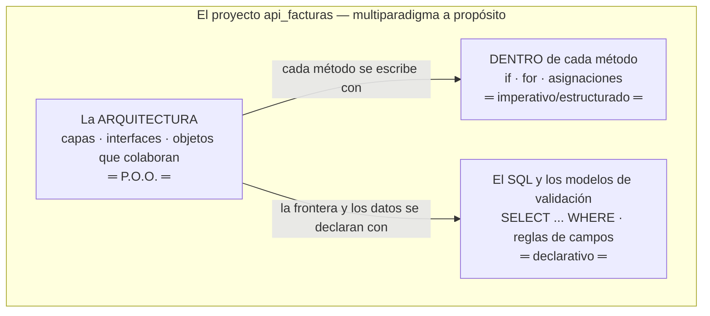
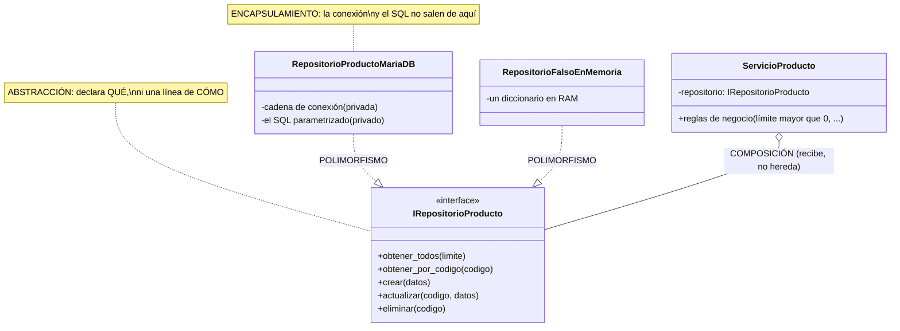
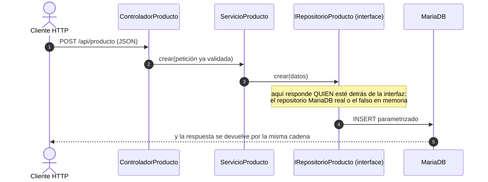

# El paradigma de Programación Orientada a Objetos (P.O.O.) en PHP

> Documento conceptual del curso. Qué es un paradigma, qué propone la P.O.O.,
> por qué este proyecto la usa, y dónde verla funcionando en la versión 1.

---

## 1. ¿Qué es un paradigma de programación?

Un paradigma es una **forma de pensar y organizar los programas**: qué es la
unidad básica de construcción y cómo se combinan. Los grandes paradigmas:

| Paradigma | Unidad básica | Idea central | Ejemplo |
|---|---|---|---|
| **Imperativo/estructurado** | la instrucción y el procedimiento | Secuencia, decisión, ciclo | C, Pascal |
| **Orientado a objetos** | el **objeto** (datos + comportamiento) | Objetos que colaboran enviándose mensajes | Java, C#, PHP moderno |
| **Funcional** | la función pura | Transformar datos sin estado mutable | Haskell, Elixir |
| **Declarativo** | la descripción del resultado | Decir QUÉ, no CÓMO | SQL, HTML |

PHP es **multiparadigma** — y este proyecto lo demuestra: se escribe código
estructurado (el router de `index.php`), orientado a objetos (las capas),
declarativo (el SQL) y ocasionalmente funcional (`array_map` con funciones
flecha). PHP nació como lenguaje de scripts y fue incorporando P.O.O. seria
(clases, interfaces, tipos) hasta el PHP 8 actual — saber cuándo usar cada
paradigma ES la competencia del curso.

### 1.1 El MISMO problema en tres paradigmas (ejemplo comparado)

Problema: calcular cuánto vale el inventario (la suma de stock × valor de
cada producto). Mírelo tres veces:

```
// IMPERATIVO: el CÓMO, paso a paso (así se ve DENTRO de un método)
$total = 0;
foreach ($productos as $p) {
    if ($p['stock'] > 0) {
        $total += $p['stock'] * $p['valorunitario'];
    }
}
```

```sql
-- DECLARATIVO: el QUÉ, sin pasos — el motor decide el CÓMO
SELECT SUM(stock * valorunitario) FROM producto WHERE stock > 0;
```

```
// P.O.O.: objetos que colaboran — cada uno con SU responsabilidad
$servicio = new ServicioProducto(new RepositorioProductoMariaDB($pdo));
$total = $servicio->valorInventario();  // el servicio le PIDE al repositorio;
                                        // nadie de afuera ve SQL ni conexiones
```

Los tres resuelven lo mismo. La diferencia es QUIÉN carga con el detalle:
en el imperativo usted; en el declarativo el motor; en la P.O.O. cada
objeto carga con SU parte — y eso es lo que permite cambiar una pieza sin
tocar las demás.

### 1.2 Dónde vive cada paradigma en ESTE proyecto (Mermaid)



**Guía de lectura:** los paradigmas no compiten — conviven por niveles. La
P.O.O. organiza el edificio; el imperativo pone los ladrillos dentro de
cada método; el declarativo describe datos y consultas. Saber CUÁL usar en
cada nivel es la competencia, no militar en uno.

## 2. Los cuatro pilares de la P.O.O.

### 2.1 Abstracción
Quedarse con lo esencial y esconder el detalle. `IRepositorioProducto` es una
abstracción: define QUÉ se puede hacer con productos (obtener, crear,
actualizar, eliminar) sin decir CÓMO ni DÓNDE se guardan.

### 2.2 Encapsulamiento
Cada objeto guarda su estado y expone solo operaciones. En la v1,
`RepositorioProductoMariaDB` encapsula la conexión PDO y el SQL: sus
propiedades son `private readonly` y nadie más en el sistema sabe que existe
un DSN. PHP lo refuerza con modificadores explícitos (`private`, `protected`,
`public`) — más estrictos que otros lenguajes del curso.

### 2.3 Herencia (y por qué aquí casi no se usa)
Reutilizar definiendo una clase a partir de otra (`extends`, "es-un"). Es el
pilar más famoso y el más **sobreutilizado**: la herencia acopla fuerte. La
regla moderna es **composición sobre herencia** — y este proyecto la sigue:
`ServicioProducto` no HEREDA de un repositorio, RECIBE un repositorio por
constructor (composición + inyección). El único `extends` de la v1 es
`NoEncontradoExcepcion extends Exception` — herencia bien usada: una
excepción ES una excepción.

### 2.4 Polimorfismo
Distintas clases responden al mismo mensaje, cada una a su manera. Es el
pilar que sostiene todo el proyecto: cualquier clase con
`implements IRepositorioProducto` puede ocupar el lugar de otra — el MariaDB
real, el falso en memoria de `pruebas/prueba_capas.php`, o el PostgreSQL que
llegará en la v3.

### 2.5 Los cuatro pilares, dibujados sobre la v1 (Mermaid)



**Guía de lectura:** los cuatro pilares están en UN dibujo. La interfaz es
la abstracción; los atributos privados del repositorio son el
encapsulamiento; las dos flechas punteadas que llegan a la misma interfaz
son el polimorfismo (piezas intercambiables); y el rombo del servicio es
composición: recibe el repositorio por constructor en vez de heredarlo.

**Herencia vs composición — el error clásico, dibujado:**

```mermaid
classDiagram
    direction LR
    class ServicioMal["ServicioProducto ❌"]
    class ServicioBien["ServicioProducto ✅"]
    ServicioMal --|> RepositorioProductoMariaDB : hereda del CONCRETO: quedó casado con MariaDB
    ServicioBien o-- IRepositorioProducto : compone la ABSTRACCIÓN: cualquier motor entra
```

**Guía de lectura:** si el servicio HEREDA del repositorio concreto, cambiar
de motor exige tocar el servicio (y probar sin BD es imposible). Si lo
COMPONE a través de la interfaz, el motor se cambia por fuera — esa
decisión de un solo rombo es la que paga todo el proyecto.

**"Objetos que se mandan mensajes" (Alan Kay) — la v1 como conversación:**



**Guía de lectura:** cada flecha es un MENSAJE entre objetos — ninguno sabe
CÓMO trabaja el siguiente, solo QUÉ mensaje entiende. Esa era la idea
original de Alan Kay al acuñar "orientado a objetos": menos árboles de
herencia, más objetos conversando.

## 3. La P.O.O. en PHP: lo que este proyecto explota

- **`interface` nativa** — el contrato es una construcción del lenguaje:

```php
interface IRepositorioProducto
{
    public function obtenerTodos(int $limite): array;
    public function obtenerPorCodigo(string $codigo): ?array;
    public function crear(array $datos): bool;
    public function actualizar(string $codigo, array $datos): int;
    public function eliminar(string $codigo): int;
}

class RepositorioProductoMariaDB implements IRepositorioProducto { … }
```

  A diferencia del *duck typing* de lenguajes dinámicos, aquí el compromiso
  es **explícito**: si a la clase le falta un método del contrato, PHP no la
  deja existir (error fatal). Tipado **nominal**: se ES del tipo porque se
  DECLARA.
- **Tipos estrictos** (`declare(strict_types=1)`): `int $limite` rechaza
  `"7"` — el tipo también es regla de negocio.
- **Constructor promotion + `readonly`** (PHP 8): el constructor declara,
  asigna y protege las dependencias en una sola línea:
  `private readonly IRepositorioProducto $repositorio`.
- **El modelo es el dato como objeto**: la clase `Producto` con sus 4
  propiedades tipadas — un `stock` que SIEMPRE es entero.
- **La frontera de entrada se construye a mano**: la validación del body
  vive en el controlador (la puerta HTTP) y hace lo que en otros stacks hace
  una librería — construirla enseña qué ES validar (tipos, rangos,
  obligatoriedad, lista blanca de columnas).

## 4. Justificación: por qué P.O.O. para este proyecto

1. **El dominio se modela solo:** producto, factura, cliente… son objetos
   naturales con datos y reglas propias.
2. **El polimorfismo es EL requisito:** la meta del proyecto (cambiar de motor
   de BD sin tocar código) es literalmente un ejercicio de polimorfismo —
   repositorios intercambiables tras una interfaz.
3. **Probabilidad de prueba:** el criterio de aceptación 6 de la v1 (probar el
   servicio con un repositorio falso en memoria) solo es posible porque el
   servicio depende de una abstracción, no de MariaDB.
4. **Puente a SOLID:** los principios SOLID (documento
   [SOLID_CAPAS_PATRONES.md](SOLID_CAPAS_PATRONES.md)) son reglas de diseño **dentro** del
   paradigma orientado a objetos — sin P.O.O. no hay SOLID que aplicar.

## 5. Ejemplo resumido: la v1 vista con lentes de P.O.O.

```
Producto (el modelo)         ← la clase entidad: el dato con tipos
ControladorProducto          ← objeto HTTP; valida el body y compone un IServicioProducto
ServicioProducto             ← objeto de NEGOCIO; compone un IRepositorioProducto
IRepositorioProducto         ← contrato (interface): abstracción pura
RepositorioProductoMariaDB   ← implementación concreta (encapsula PDO y SQL)
RepositorioFalsoEnMemoria    ← otra implementación (¡polimorfismo!) para probar sin BD
```

El mismo `ServicioProducto` funciona con ambos repositorios sin cambiar una
línea — eso es el paradigma haciendo su trabajo. En la v3, un tercer objeto
(`RepositorioProductoPostgreSQL`) entrará por la misma puerta.

## 6. Referencias

1. PHP — manual oficial de clases y objetos:
   <https://www.php.net/manual/es/language.oop5.php>
2. PHP — interfaces de objetos:
   <https://www.php.net/manual/es/language.oop5.interfaces.php>
3. PHP — declaraciones de tipos estrictos:
   <https://www.php.net/manual/es/language.types.declarations.php>
4. Refactoring Guru (es) — catálogo de patrones de diseño orientados a objetos:
   <https://refactoring.guru/es/design-patterns>
5. Gamma, Helm, Johnson, Vlissides — *Design Patterns* (GoF, 1994): el origen
   de "composición sobre herencia" y "programar contra interfaces".
6. En este repositorio: las interfaces y capas de la
   [v1](spec_kit/versiones/v1_producto_mariadb/3_plan.md).
