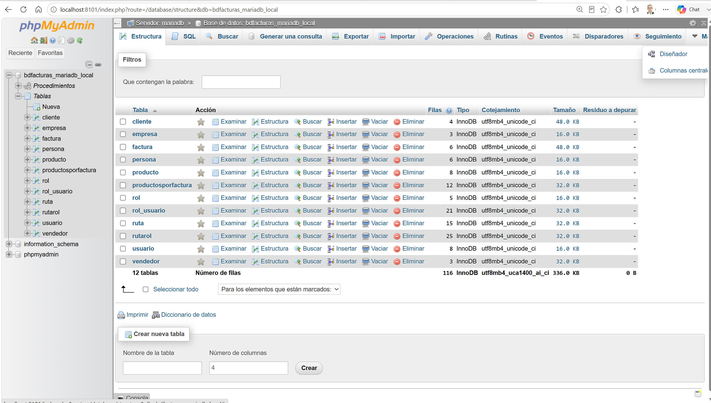
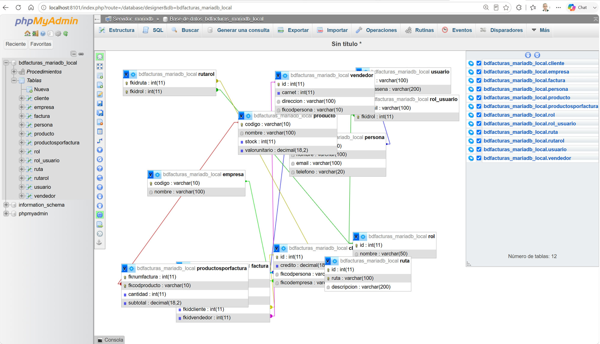
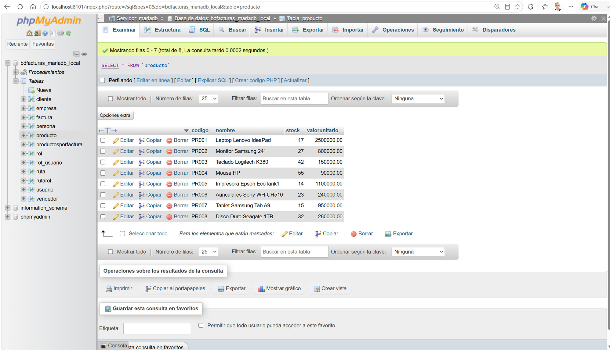
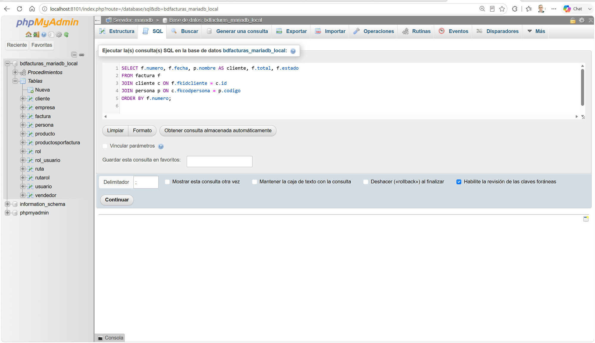
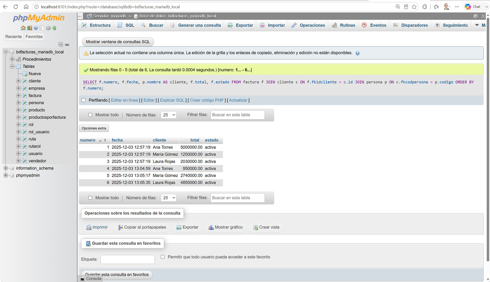
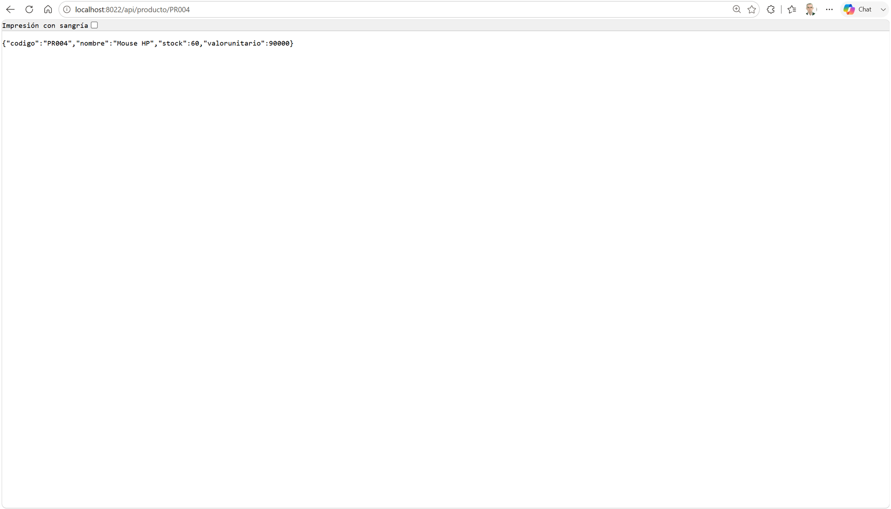
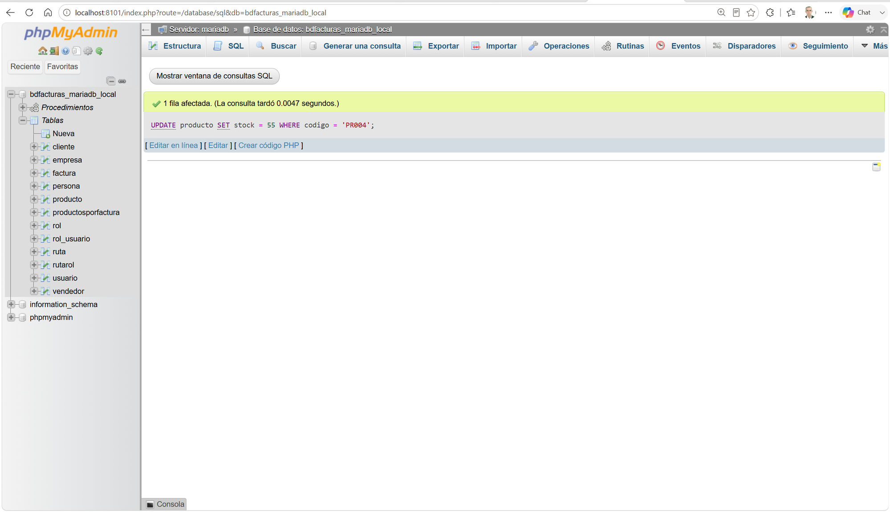
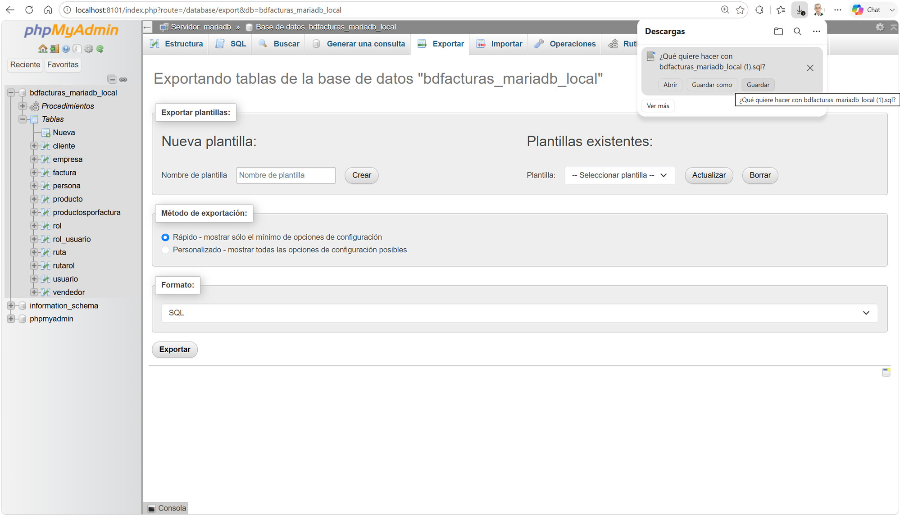

# Tutorial — Administrar la base de datos MariaDB con phpMyAdmin

> Tutorial paso a paso para explorar y administrar **bdfacturas** (la BD del
> proyecto) usando **phpMyAdmin**, el administrador web de MariaDB que ya
> viene incluido en XAMPP — no hay que instalar nada.
>
> Prerrequisitos: en el panel de XAMPP, **MySQL** y **Apache** encendidos
> (Apache es quien sirve phpMyAdmin), y la BD creada con `.\db\crear_bd.ps1`
> (ver [README](../README.md)).
>
> 📷 **Nota sobre las capturas:** se tomaron sobre un phpMyAdmin idéntico
> que corre en otra dirección (`localhost:8101`). En XAMPP la dirección es
> **`http://localhost/phpmyadmin`** — todo lo demás se ve y funciona igual.

---

## Paso 1 — Abrir phpMyAdmin

phpMyAdmin viene incluido en XAMPP (lo sirve su Apache). Con Apache y
MySQL encendidos, abra en su navegador:

**http://localhost/phpmyadmin**

No pide usuario ni contraseña: el phpMyAdmin de XAMPP entra directo como
`root` (el administrador sin clave de XAMPP). Debe ver la página principal
de phpMyAdmin y, en el panel izquierdo, la base de datos
**`bdfacturas_mariadb_local`**.


La página principal informa sobre los DOS servidores involucrados: el
**servidor de base de datos** (MariaDB) y el **servidor web** (el Apache
de XAMPP, donde corre phpMyAdmin mismo) — dos programas distintos aunque
vivan en la misma carpeta `C:\xampp`.

> 💡 **Nota:** phpMyAdmin guarda sus funcionalidades extendidas — entre
> ellas el **Diseñador** de diagramas — en una base de datos interna
> propia llamada `phpmyadmin` (el "almacenamiento de configuración"). En
> XAMPP esa BD ya viene creada de fábrica. Si alguna vez ve abajo la
> advertencia amarilla *"El almacenamiento de configuración phpMyAdmin no
> está completamente configurado"*, entre a esa advertencia y siga el
> enlace "Find out why" — phpMyAdmin mismo ofrece crearla.

---

## Paso 2 — Abrir la base de datos y ver sus tablas

En el panel izquierdo haga clic en **`bdfacturas_mariadb_local`**. Se abre
la pestaña **Estructura**: la lista de las **12 tablas** de bdfacturas con
su número de filas, motor (InnoDB) y tamaño.



Para leer en esta pantalla:

- Cada tabla trae sus acciones directas: **Examinar** (ver filas),
  **Estructura** (ver columnas), **Buscar**, **Insertar**, **Vaciar** y
  **Eliminar** — las dos últimas son destructivas, trátelas con respeto.
- Abajo, el total: **12 tablas, 116 filas** — la bdfacturas completa que
  creó `db/init.sql` la primera vez que subió el proyecto.
- En el menú superior, bajo **Más ▾**, apareció el **Diseñador** (existe
  gracias a la BD interna `phpmyadmin` del paso 1).
- En el árbol izquierdo también se ven los **Procedimientos** almacenados
  de la BD y la BD interna `phpmyadmin` (esa no se toca: es de phpMyAdmin).

---

## Paso 3 — El Diseñador: ver el diagrama de tablas y relaciones

En el menú superior: **Más ▾ → Diseñador**. phpMyAdmin dibuja las 12 tablas
como cajas (tabla arriba, columnas abajo, llave dorada = PK) unidas por
líneas: las **llaves foráneas**. Ese diagrama ES el modelo relacional de
bdfacturas: persona ← cliente ← factura ← productosporfactura → producto,
más el módulo de seguridad (usuario, rol, ruta y sus tablas puente).

Puede arrastrar las cajas para acomodar el diagrama (la posición se guarda
en la BD interna `phpmyadmin`, no en bdfacturas).



Para leer en el diagrama:

- Cada caja es una tabla: nombre arriba, columnas con su tipo abajo; la
  llave dorada marca la **llave primaria** (PK).
- Cada línea es una **llave foránea** (FK): sale de la columna `fk...` de
  una tabla y llega a la PK de otra. Por ejemplo,
  `productosporfactura.fkcodproducto` → `producto.codigo`.
- En el panel derecho puede mostrar/ocultar tablas con los checkbox — útil
  para aislar un módulo (solo facturación, o solo seguridad).
- El título dice "Sin título *": si quiere conservar el acomodo, guárdelo
  con el icono de disquete de la barra izquierda (se guarda en la BD
  interna `phpmyadmin`).

---

## Paso 4 — Examinar los datos de una tabla

En el panel izquierdo haga clic directamente en la tabla **`producto`**
(o en su acción **Examinar** desde la Estructura). Se abre la pestaña
**Examinar** con las **8 filas** de la tabla: es el resultado de un
`SELECT * FROM producto` que phpMyAdmin arma por usted (la consulta se ve
arriba de la cuadrícula).



Para leer en esta pantalla:

- Arriba está la consulta real: `SELECT * FROM producto` — todo lo que
  phpMyAdmin muestra sale de SQL normal, la interfaz solo lo arma por usted.
- Cada fila trae **Editar / Copiar / Borrar**. Editar abre un formulario
  con los valores actuales (lo usaremos más adelante).
- Estos 8 productos son LOS MISMOS que responde la API en
  `http://localhost:8022/api/producto` — API y phpMyAdmin son dos clientes
  distintos de la misma BD.
- "Guardar esta consulta en favoritos" y "Mostrar gráfico" existen gracias
  al almacenamiento de configuración del paso 1.

---

## Paso 5 — Ejecutar SQL propio (con JOIN)

Hasta ahora phpMyAdmin escribió el SQL; ahora lo escribe usted. Clic en la
base de datos **`bdfacturas_mariadb_local`** (panel izquierdo) y luego en la
pestaña **SQL**. Pegue esta consulta, que une tres tablas del diagrama del
paso 3 (factura → cliente → persona) para responder "¿de quién es cada
factura?":

```sql
SELECT f.numero, f.fecha, p.nombre AS cliente, f.total, f.estado
FROM factura f
JOIN cliente c ON f.fkidcliente = c.id
JOIN persona p ON c.fkcodpersona = p.codigo
ORDER BY f.numero;
```



Clic en **Continuar** (abajo a la derecha). Deben salir las 6 facturas, cada
una con el nombre real del cliente en lugar del `fkidcliente` numérico:



Dos detalles del resultado:

- La advertencia *"La selección actual no contiene una columna única"* es
  normal en un JOIN: como las filas del resultado mezclan varias tablas,
  phpMyAdmin no ofrece Editar/Borrar sobre ellas (¿en cuál tabla editaría?).
  Sobre una tabla sola (paso 4) sí aparecen.
- El `total` de cada factura NO se digitó a mano: lo mantienen los
  **triggers** de la BD (pestaña **Disparadores**) que suman los subtotales
  del detalle. Puede verlos en `db/init.sql`.

---

## Paso 6 — Editar una fila (y verla cambiar en la API)

phpMyAdmin también escribe. Vamos a subirle el stock a un producto y a
comprobar que la API lo ve al instante — son dos clientes de la misma BD.

1. Panel izquierdo → tabla **`producto`** (pestaña Examinar).
2. En la fila de **PR004 (Mouse HP)** clic en **Editar**.
3. En el formulario cambie **stock** de `55` a `60` y clic en **Continuar**.
   phpMyAdmin muestra el `UPDATE` que ejecutó.
4. Ahora abra en otra pestaña del navegador
   **http://localhost:8022/api/producto/PR004** — el JSON debe traer
   `"stock": 60`:



**La moraleja del tutorial:** phpMyAdmin y la API son **dos clientes de la
misma base de datos**. Lo que uno escribe, el otro lo lee — no hay "copias"
ni sincronización: es la única bdfacturas que vive en el MariaDB de XAMPP
(`C:\xampp\mysql\data`).

---

## Paso 7 — Deshacer el cambio con SQL (UPDATE)

En el paso 6 editó con formulario; ahora lo mismo con SQL puro, para dejar
el dato como estaba. Pestaña **SQL** de la base de datos y ejecute:

```sql
UPDATE producto SET stock = 55 WHERE codigo = 'PR004';
```

phpMyAdmin responde *"1 fila afectada"*. El `WHERE` es lo importante: sin
él, el UPDATE tocaría TODAS las filas de la tabla (phpMyAdmin le pediría
confirmación, pero no cuente con esa red en otros clientes).



Si quiere, confirme en la otra pestaña que
`http://localhost:8022/api/producto/PR004` volvió a `"stock": 55`.

---

## Paso 8 — Exportar un respaldo de la base de datos

Último paso: sacar una copia completa de bdfacturas como archivo `.sql`
(estructura + datos), útil como respaldo o para llevarse la BD a otra parte.

1. Clic en **`bdfacturas_mariadb_local`** (panel izquierdo) y luego en la
   pestaña **Exportar**.
2. Deje el método **Rápido** y el formato **SQL**.
3. Clic en **Exportar** — el navegador descarga
   `bdfacturas_mariadb_local.sql`.

Ábralo con un editor: verá los `CREATE TABLE` y los `INSERT` de todo lo que
exploró en este tutorial — el mismo tipo de contenido que `db/init.sql`,
que es, ni más ni menos, el "respaldo" con el que nace la base de datos.



---

## Resumen

| Paso | Qué aprendió |
|---|---|
| 1 | Abrir phpMyAdmin (el de XAMPP) y leer su página principal |
| 2 | La Estructura: las 12 tablas de bdfacturas |
| 3 | El Diseñador: el modelo relacional dibujado (PK, FK) |
| 4 | Examinar los datos de una tabla (el SELECT que arma la interfaz) |
| 5 | SQL propio: un JOIN de 3 tablas |
| 6 | Editar con formulario y ver el cambio desde la API |
| 7 | Editar con SQL (UPDATE con WHERE) |
| 8 | Exportar un respaldo completo (.sql) |
