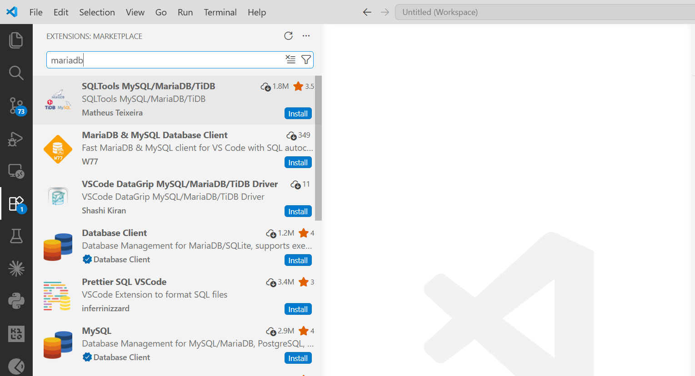
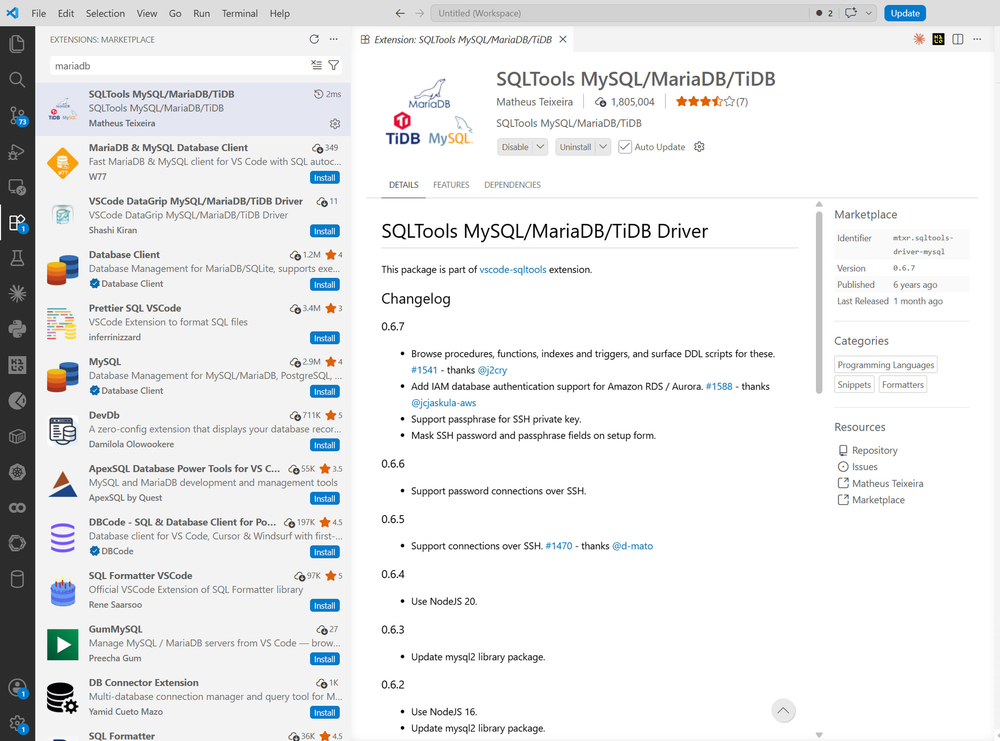
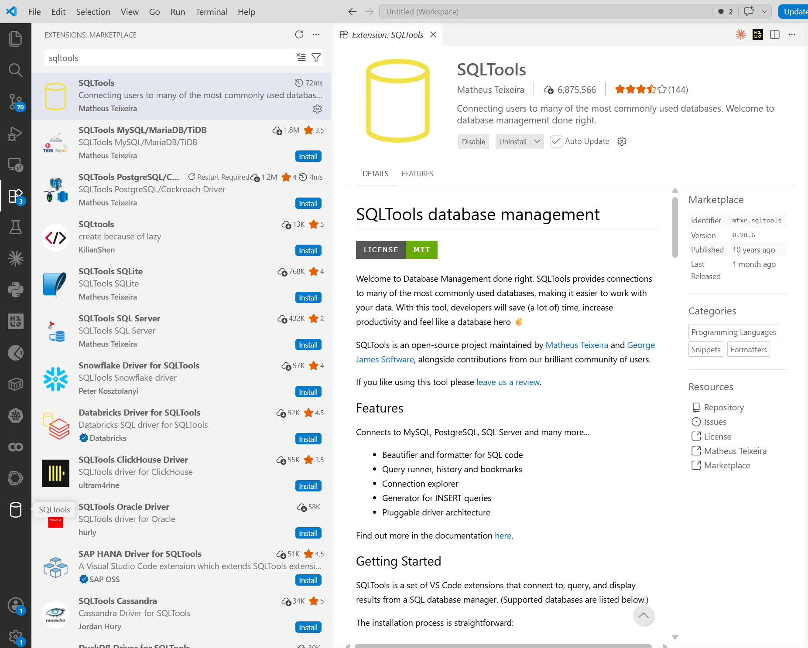
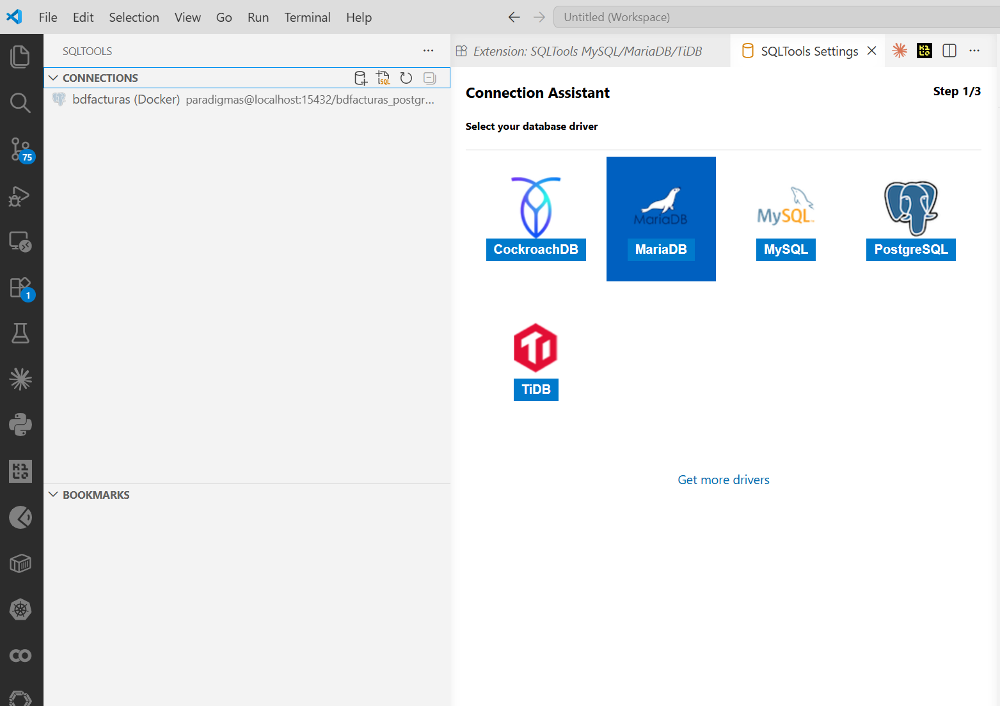
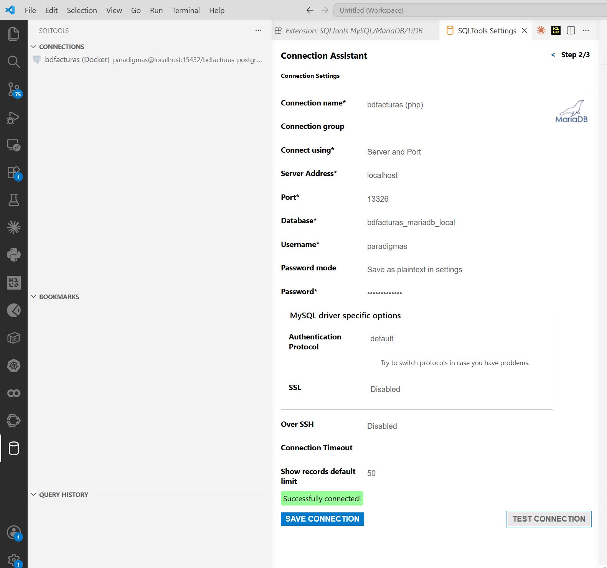
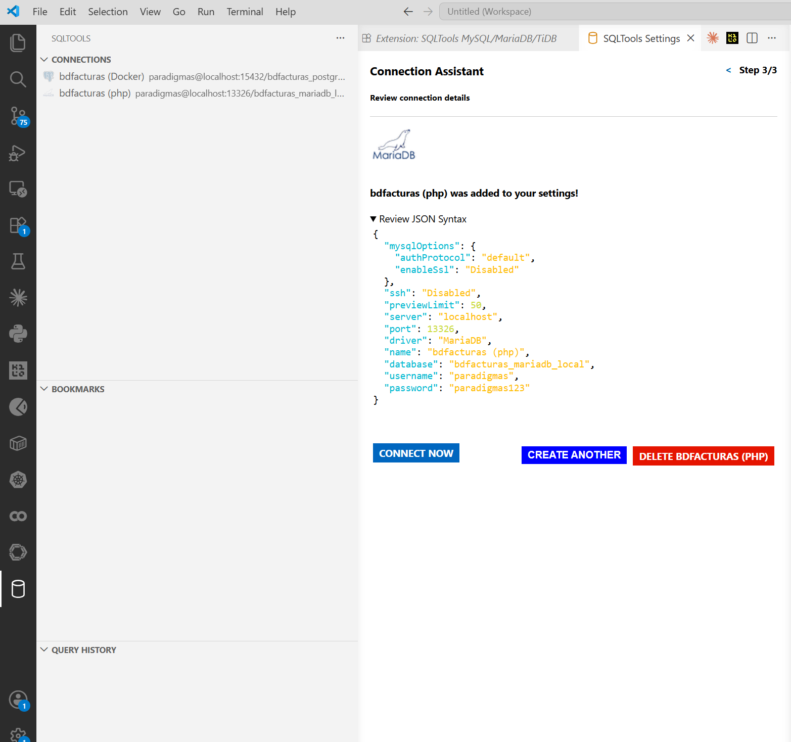
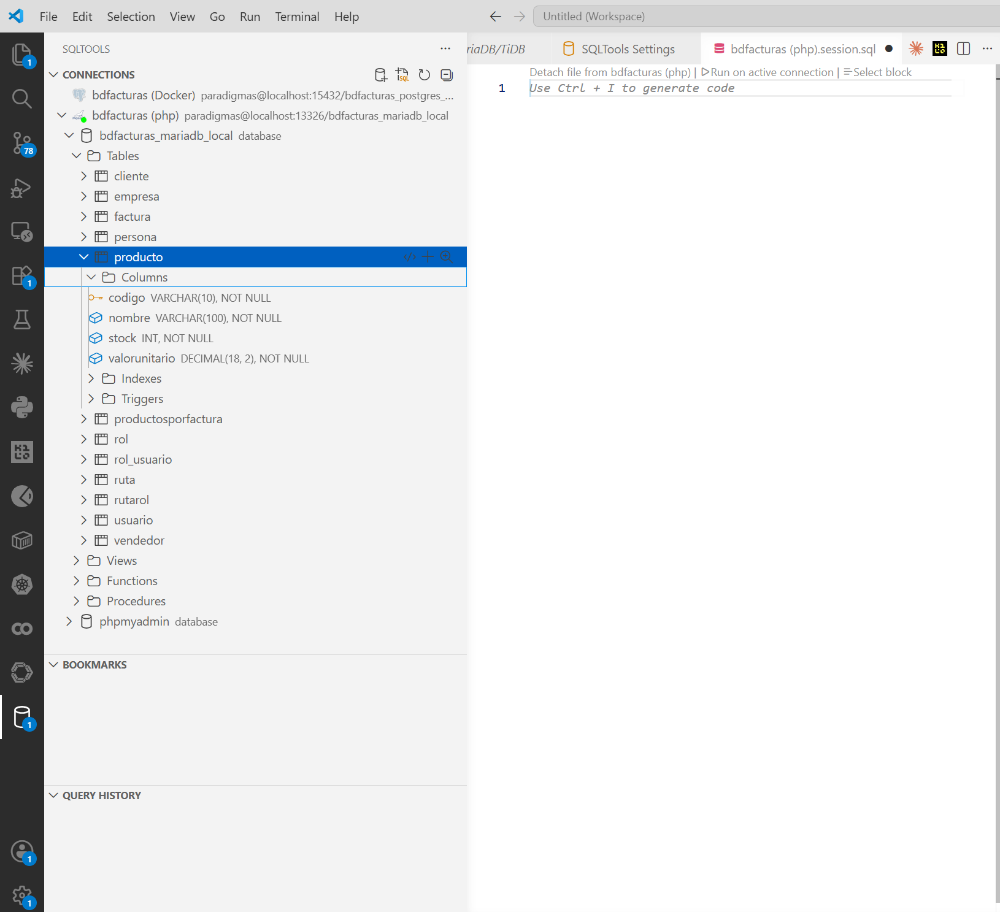
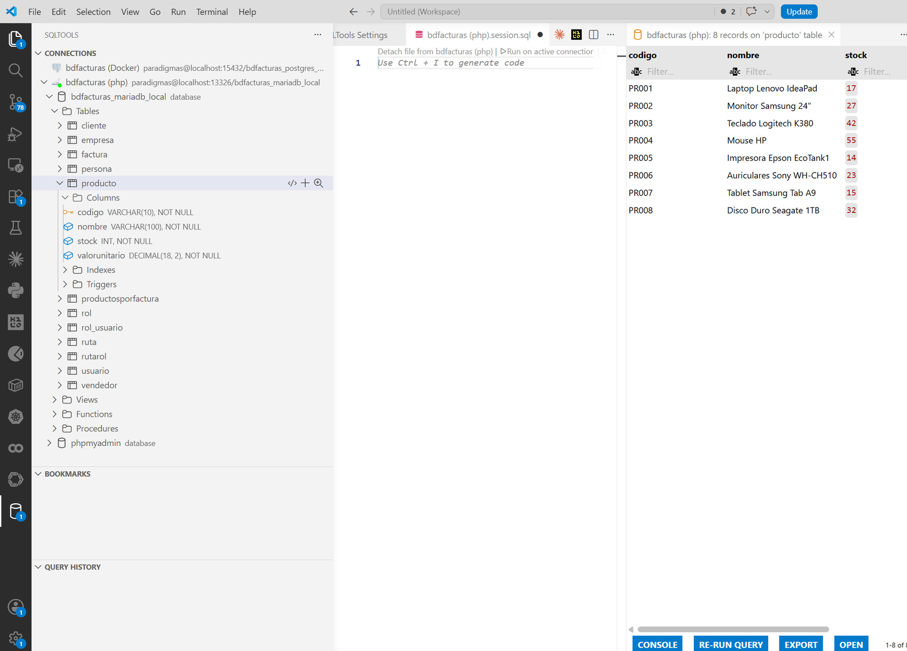
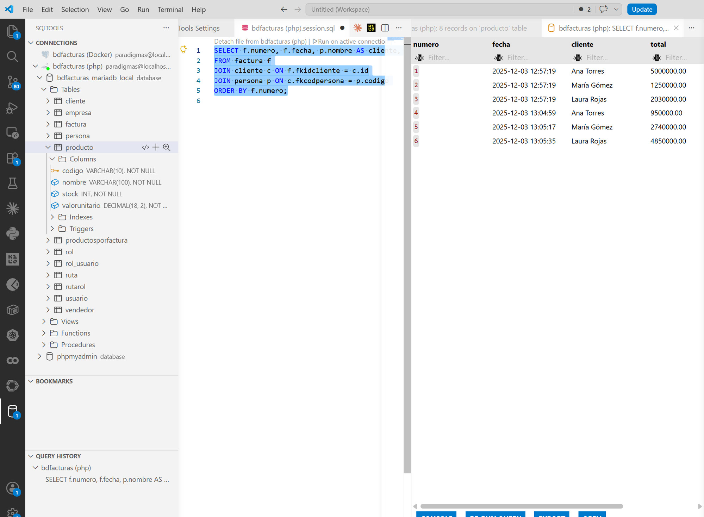
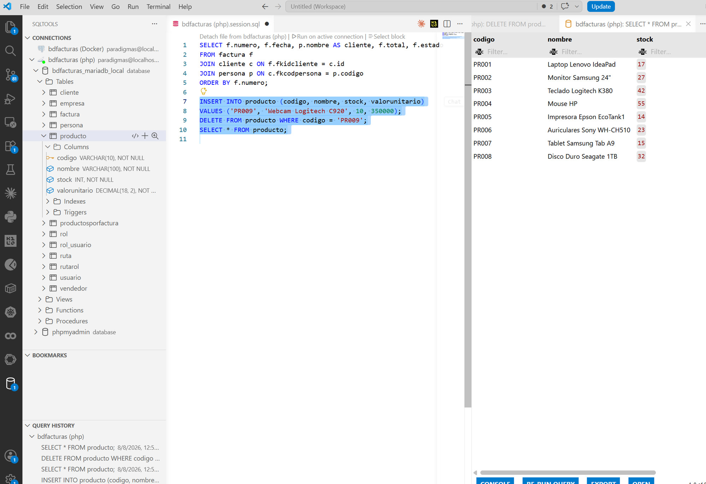

# Tutorial — Administrar MariaDB desde VS Code con SQLTools

> Tutorial paso a paso para explorar y consultar **bdfacturas** sin salir de
> VS Code, usando la extensión **SQLTools** con su driver de MySQL/MariaDB.
> Es la alternativa "de programador" al [tutorial de
> phpMyAdmin](TUTORIAL_PHPMYADMIN.md): misma base de datos, pero en el editor
> donde ya está su código — ideal para consultar mientras programa.
>
> **Prerrequisitos:** VS Code en Windows, el MySQL de XAMPP encendido y la
> BD creada con `.\db\crear_bd.ps1` (ver el [README](../README.md)).
> MariaDB escucha en `localhost:3306`.
>
> 📷 **Nota sobre las capturas:** se tomaron contra un MariaDB idéntico que
> escucha en otro puerto (`13326`). En XAMPP el puerto es **`3306`** — todo
> lo demás se ve y funciona igual.

---

## Paso 0 — Instalar SQLTools y su driver de MySQL/MariaDB

Abra la vista de **Extensiones** (`Ctrl+Shift+X`) y busque `sqltools`.
Instale **dos** extensiones (ambas de Matheus Teixeira):

1. **SQLTools** (`mtxr.sqltools`) — el administrador de bases de datos.
2. **SQLTools MySQL/MariaDB/TiDB** (`mtxr.sqltools-driver-mysql`) — el
   conector para MariaDB. También aparece buscando `mariadb`:



Ojo al elegir: en la lista hay varias extensiones parecidas de otros
autores — la del curso es la de **Matheus Teixeira**, la misma casa de
SQLTools. Instalada se ve así (fíjese en el identificador
`mtxr.sqltools-driver-mysql` en el panel Marketplace):



> ¿Por qué dos? SQLTools funciona con **drivers por motor** — el mismo patrón
> del proyecto: un núcleo genérico + un adaptador por base de datos. En la
> lista se ven los demás drivers (PostgreSQL, SQL Server, SQLite…): cuando la
> v3 agregue PostgreSQL, se instalará su driver y TODO lo demás de este
> tutorial seguirá igual.

Al instalar el driver, VS Code muestra **"Restart Required"** en la fila de
la extensión (y un contador en el ícono de Extensiones):


Haga clic en ese *Restart Required* (o `Ctrl+Shift+P` → `Reload Window`): la
ventana se recarga en segundos y no se pierde nada. Al volver, aparece el
**ícono de cilindro** (base de datos) en la barra lateral izquierda — es
SQLTools:



> ⚠️ **El tropiezo clásico:** si instala solo SQLTools y da *Add New
> Connection*, el asistente se queda pegado en *"Couldn't find any installed
> drivers — Try installing drivers before proceeding"*:
>
> 
>
> No es un error de la BD ni del proyecto: **falta la segunda extensión** (el
> driver de MySQL/MariaDB). Se resuelve así, sin salir de VS Code:
>
> 1. **Cierre la pestaña** del asistente atascado ("SQLTools Settings").
> 2. Vuelva a **Extensiones** (`Ctrl+Shift+X`), busque `sqltools` e instale
>    **SQLTools MySQL/MariaDB/TiDB**.
> 3. Recargue la ventana: `Ctrl+Shift+P` → escriba `Reload Window` → Enter.
>    (El asistente NO detecta drivers instalados después de abrirse — la
>    recarga es obligatoria y no pierde nada.)
> 4. Clic en el cilindro → **Add New Connection** — ahora sí aparece
>    MySQL/MariaDB como opción.

---

## Paso 1 — Crear la conexión a la BD del proyecto

Clic en el **cilindro** de la barra lateral y luego en **Add New
Connection**. El asistente (paso 1 de 3) muestra los motores que el driver
instalado sabe hablar — elija **MariaDB**:



Llene el formulario (paso 2 de 3) con los datos del curso:

| Campo | Valor | Por qué |
|---|---|---|
| Connection name | `bdfacturas (php)` | Libre — cómo se verá en el panel |
| Connect using | `Server and Port` | Conexión directa por red |
| Server Address | `localhost` | El puerto está publicado hacia SU PC |
| Port | `3306` | El puerto estándar de MySQL/MariaDB (el de XAMPP) |
| Database | `bdfacturas_mariadb_local` | La BD que crea `db/init.sql` |
| Username | `paradigmas` | Usuario del curso |
| Use password | `Save as plaintext in settings` | Didáctico: credenciales de juguete |
| Password | `paradigmas123` | La del usuario del curso (creado por `crear_bd.ps1`) |

> Las credenciales son las del curso (`paradigmas`/`paradigmas123`), las
> mismas que usa la API — el usuario las crea `db\crear_bd.ps1`. El `root`
> sin clave de XAMPP queda para phpMyAdmin y administración.

Abajo del formulario: **TEST CONNECTION** debe responder *"Successfully
connected!"* en verde; luego **SAVE CONNECTION**:



El asistente cierra (paso 3 de 3) mostrando el **JSON** de la conexión — es
lo que quedó guardado en el `settings.json` de VS Code; el formulario es
solo una cara bonita para escribir ese objeto. Clic en **CONNECT NOW**:



> En el panel CONNECTIONS pueden convivir varias conexiones — en la captura
> aparece también otra conexión guardada previamente (un PostgreSQL en el
> puerto `15432`) junto a la nueva (la MariaDB del curso). Cada base de datos
> vive en su propio puerto, así que pueden estar todas conectadas a la vez.

---

## Paso 2 — Explorar la base de datos

Con la conexión activa (el enchufe verde), expanda el árbol en el panel
CONNECTIONS:

**bdfacturas (php)** → **bdfacturas_mariadb_local** → **Tables**

Ahí están las **12 tablas**. Expanda **producto** para ver sus columnas con
tipo y llave, y haga clic en el icono de la **lupa** (magnifier) junto al
nombre de la tabla: SQLTools abre una pestaña con las filas (es un
`SELECT * ... LIMIT 50` — el límite es el "Show records default limit" que
quedó en la conexión).



Para leer en el árbol:

- En **producto**: la llavecita dorada junto a `codigo` es la **PK**; cada
  columna muestra su tipo (`VARCHAR(10)`, `INT`, `DECIMAL(18,2)`) y su
  `NOT NULL`.
- La tabla también expone sus **Indexes** y sus **Triggers** — los triggers
  de facturación de `db/init.sql` están ahí, visibles desde el editor.
- Se ve la otra base del servidor: `phpmyadmin` (el almacenamiento del
  [tutorial de phpMyAdmin](TUTORIAL_PHPMYADMIN.md) — no se toca).
- SQLTools abrió además una pestaña `bdfacturas (php).session.sql`: un
  archivo de borrador para escribir SQL contra esta conexión (lo usamos en
  el paso 3). Está ignorado en `.gitignore` — es suyo, no del repositorio.

Y el resultado de la lupa — las 8 filas de `producto` en una grilla, con
filtros por columna y botón **EXPORT**:



---

## Paso 3 — Consultar con SQL propio

En la pestaña **`bdfacturas (php).session.sql`** (si la cerró: clic derecho
en la conexión → *New SQL File*) escriba:

```sql
SELECT f.numero, f.fecha, p.nombre AS cliente, f.total, f.estado
FROM factura f
JOIN cliente c ON f.fkidcliente = c.id
JOIN persona p ON c.fkcodpersona = p.codigo
ORDER BY f.numero;
```

Para ejecutar: deje el cursor sobre la consulta y presione
**`Ctrl+E` `Ctrl+E`** (dos veces seguidas — es un "acorde" de teclas), o use
el enlace **Run on active connection** que aparece arriba del archivo.
Deben salir las 6 facturas con su cliente en una grilla.

> `Ctrl+E Ctrl+E` ejecuta **la consulta donde está el cursor** (o el texto
> seleccionado). Con varias consultas en el mismo archivo, seleccione la
> que quiere y ejecute solo esa.



Fíjese en el panel **QUERY HISTORY** (abajo a la izquierda): SQLTools va
guardando cada consulta ejecutada — puede volver a cualquiera con doble
clic.

---

## Paso 4 — Insertar y eliminar con SQL

El ciclo completo de escritura, desde el mismo archivo. Escriba estas
consultas DEBAJO de la anterior (cada una se ejecuta por separado):

```sql
INSERT INTO producto (codigo, nombre, stock, valorunitario)
VALUES ('PR009', 'Webcam Logitech C920', 10, 350000);

SELECT * FROM producto;

DELETE FROM producto WHERE codigo = 'PR009';
```

1. Cursor sobre el **INSERT** → `Ctrl+E Ctrl+E` → responde *1 row affected*.
2. Cursor sobre el **SELECT** → `Ctrl+E Ctrl+E` → la grilla muestra
   **9 productos** (apareció PR009).
3. Cursor sobre el **DELETE** → `Ctrl+E Ctrl+E` → *1 row affected*; repita
   el SELECT: **8 productos** otra vez.

> El mismo respeto que en phpMyAdmin: DELETE **siempre con WHERE**. Y la
> misma moraleja: entre el paso 1 y el 3, PR009 también existía para la API
> (`http://localhost:8022/api/producto/PR009`) — un solo dato, muchos
> clientes.



En la captura se lee la historia completa: el **QUERY HISTORY** registra
INSERT → SELECT (con 9) → DELETE → SELECT, y la grilla final vuelve a los
**8 productos** — el ciclo de escritura completo sin salir del editor.

---

## Cierre — ¿phpMyAdmin o SQLTools?

Los dos hablan el mismo SQL con la misma BD; cambia el contexto:

| | phpMyAdmin | SQLTools |
|---|---|---|
| Dónde vive | El navegador (el Apache de XAMPP) | Dentro de VS Code |
| Instalación | Ninguna (ya está en el proyecto) | 2 extensiones + conexión |
| Fuerte en | Explorar visual: Diseñador, exportar/importar, editar con formularios | Consultar mientras programa; el SQL queda en un archivo |
| Ideal para | Entender la BD la primera vez | El día a día escribiendo la API |

No hay que elegir: en este curso conviven. Y la lección de fondo es la
misma de los dos tutoriales: **la base de datos es una sola** — phpMyAdmin,
SQLTools y la API de PHP son solo tres clientes distintos del mismo
servidor MariaDB de XAMPP.

## Resumen

| Paso | Qué aprendió |
|---|---|
| 0 | Instalar SQLTools + driver MySQL/MariaDB (y el tropiezo del driver faltante) |
| 1 | Crear la conexión (localhost:3306) con test y su JSON en settings |
| 2 | Explorar el árbol: tablas, columnas, PK, triggers; la lupa |
| 3 | SQL propio con `Ctrl+E Ctrl+E`: el JOIN de 3 tablas |
| 4 | Ciclo de escritura: INSERT → verificar → DELETE con WHERE |

